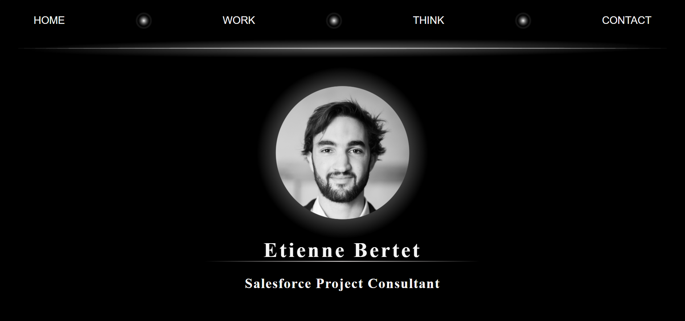

This personal presentation website was made in 2023 while learning how to code with HTML, CSS, PHP, and JavaScript.

It features a classic collection of PHP files, JavaScript files, and image repositories. The images are designed personally with the open source software Inkscape.

This website used to be hosted on OVH, with an SMTP configuration, but is not accessible on a remote server anymore.

